# :feature:address module
## Dependency graph

|                                                                                                                 |                                                                                                                                             |                                                                                                                                           |
|-----------------------------------------------------------------------------------------------------------------|---------------------------------------------------------------------------------------------------------------------------------------------|-------------------------------------------------------------------------------------------------------------------------------------------|
|                       |                                      | 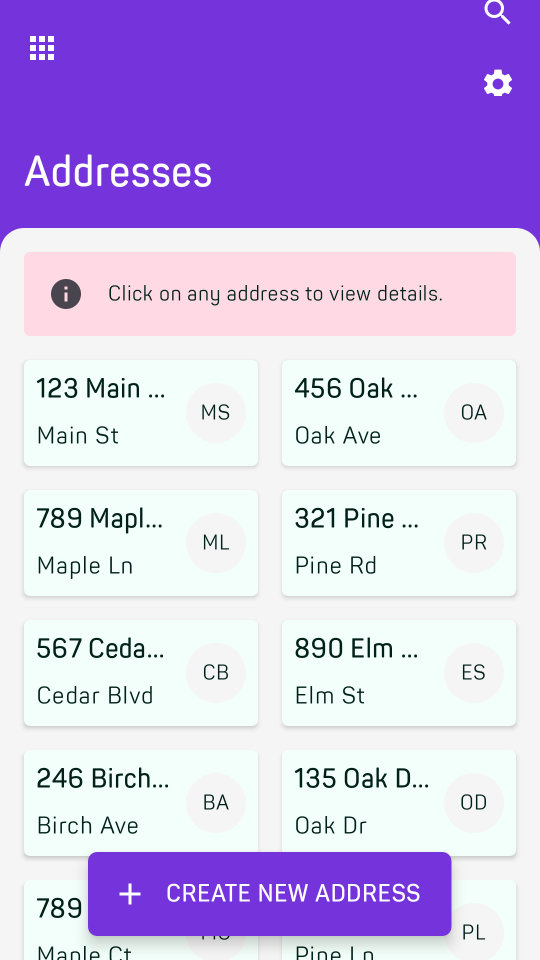                                    |
| 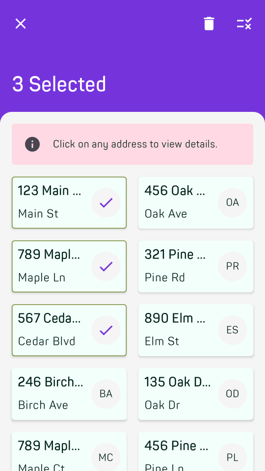            |                                 | 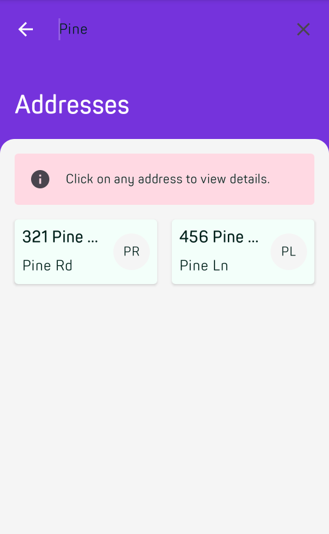                          |
| 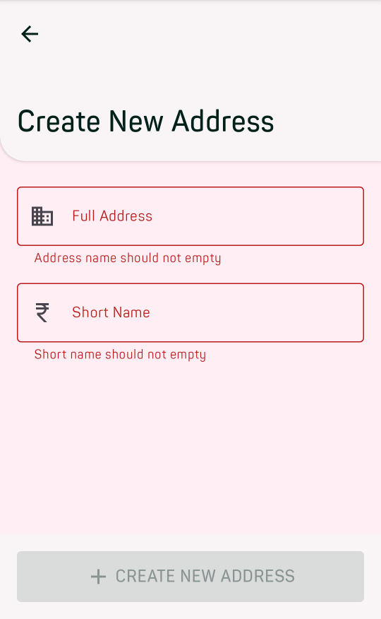 |                              | 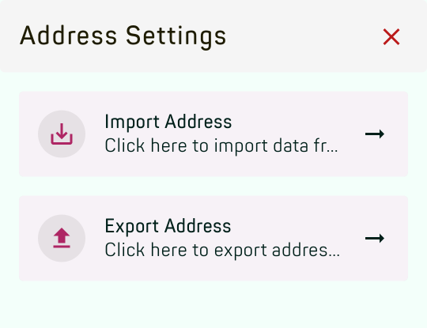                                            |
|        | 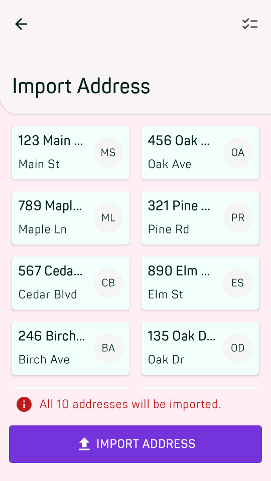                                     |                                  |
| 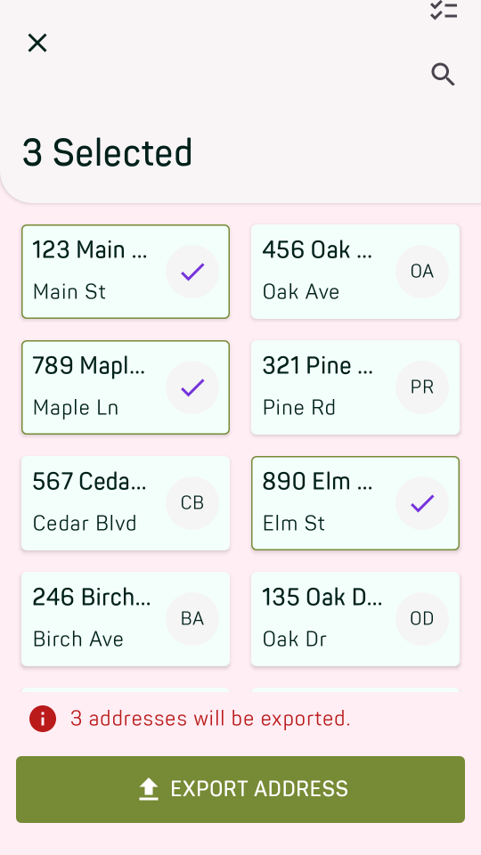         |  | 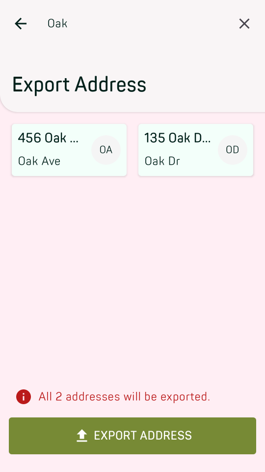 |
| 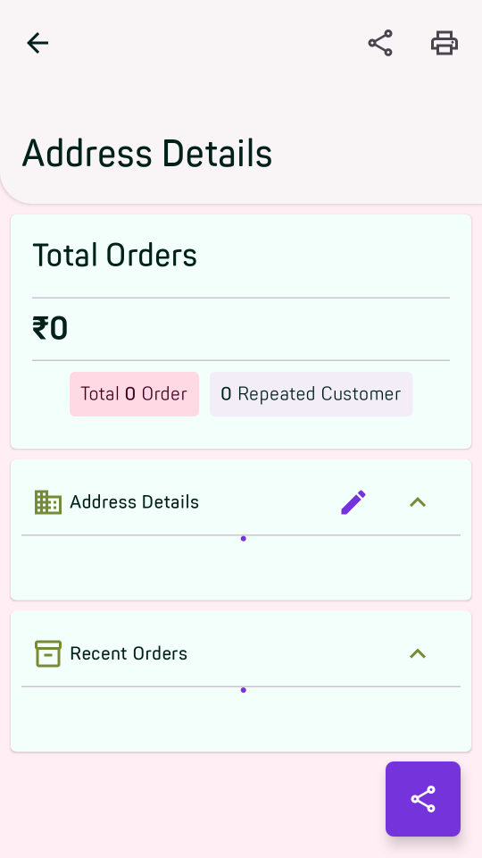          | 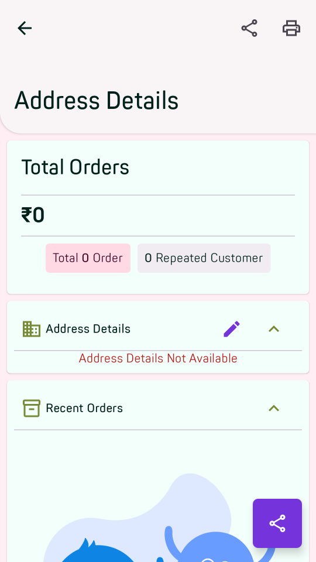                                          | 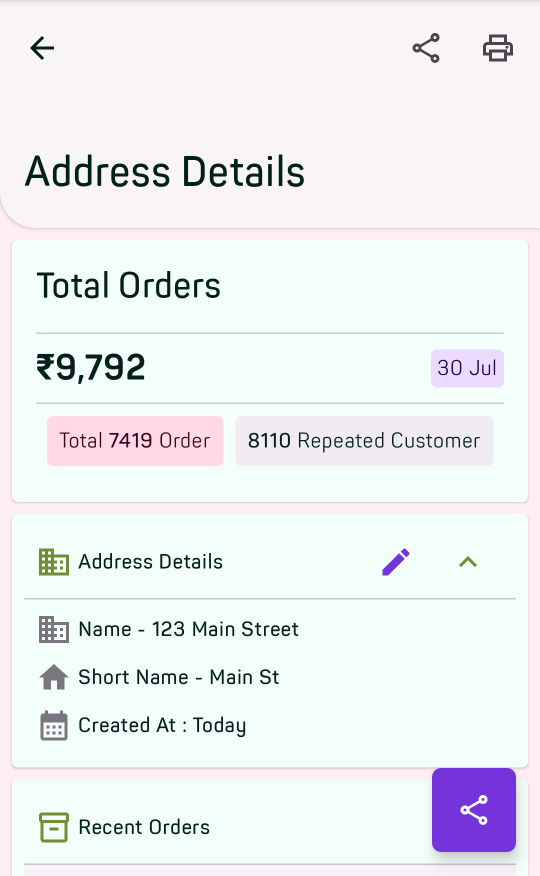                                |

